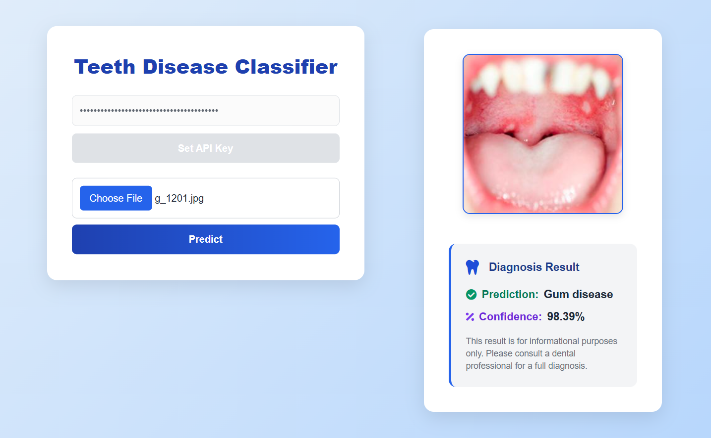

# Teeth Classification System



## Overview
The Teeth Classification System is a deep learning-based solution for automated diagnosis of various dental conditions from images. It leverages convolutional neural networks (CNNs) and transfer learning to classify oral diseases, providing a fast and reliable tool for dental professionals and researchers.


## Features
- **Image Classification**: Detects and classifies multiple dental conditions from input images.
- **Modern Deep Learning**: Utilizes InceptionV3 and other state-of-the-art architectures.
- **Data Augmentation**: Improves model robustness using rotation, zoom, and flip transformations.
- **Interactive API**: FastAPI backend with secure API key authentication for web and mobile integration.
- **User-Friendly Frontend**: Upload images and view predictions with confidence scores in a modern web interface.
- **Notebook Workflow**: Jupyter notebook for data exploration, model training, and evaluation.

## Project Structure
```
project1-teeth/
├── Artifacts/
│   └── teeth_classification_model.h5      # Trained model file
├── notebook/
│   └── teeth.ipynb                        # Data analysis and training notebook
├── src/
│   ├── config.py                          # Configuration and model loading
│   └── inference.py                           
├── api.py                                 # FastAPI backend
├── web.html                               # Frontend web interface
├── .env                                   # Environment variables
└── README.md                              # Project documentation
```

## Setup Instructions
### 1. Clone the Repository
```bash
git clone https://github.com/mohamed-aliii/Teeth-classification-system.git
cd project1-teeth
```

### 2. Environment Setup
- Install Python 3.8+
- Create a virtual environment:
  ```bash
  python -m venv venv
  source venv/bin/activate  # On Windows: venv\Scripts\activate
  ```
- Install dependencies:
  ```bash
  pip install -r requirements.txt
  ```
- Set up `.env` file with your API key and configuration:
  ```env
  APP_NAME="Teeth Classification System"
  APP_VERSION="1.0.0"
  API_KEY="your_api_key_here"
  ```

### 3. Dataset Preparation
- Place your images in the `Teeth_Dataset` directory, organized by class and split (Training, Validation, Testing).

### 4. Model Training (Optional)
- Use the notebook `notebook/teeth.ipynb` to explore data, train, and evaluate models.
- The trained model will be saved as `Artifacts/teeth_classification_model.h5`.

### 5. Running the API
- Start the FastAPI server:
  ```bash
  uvicorn api:app --reload
  ```
- The API will be available at `http://127.0.0.1:8000`.

### 6. Using the Web Interface
- Open `web.html` in your browser.
- Enter your API key, upload an image, and view the prediction and confidence score.

## API Endpoints
- `POST /predict` : Upload an image and get the predicted class and confidence. Requires `x-api-key` header.
- `GET /auth` : Validate API key before using the prediction endpoint.

## Technologies Used
- Python, TensorFlow, Keras
- FastAPI
- HTML, CSS (Tailwind), JavaScript
- Jupyter Notebook

## Classes Supported
- Condition Of Soft Tissues
- Candidiasis
- Gum disease
- Mucocele
- Oral Cancer
- Oral Lichen Planus
- Odontogenic Tumor

## Example Usage
**Python (API call):**
```python
import requests

url = 'http://127.0.0.1:8000/predict'
headers = {'x-api-key': 'your_api_key_here'}
files = {'file': open('test_image.jpg', 'rb')}
response = requests.post(url, headers=headers, files=files)
print(response.json())
```

## Contributing
Contributions are welcome! Please open issues or submit pull requests for improvements, bug fixes, or new features.

## License
This project is licensed under the MIT License.

## Contact
For questions or support, please contact the maintainer at [your-email@example.com].

